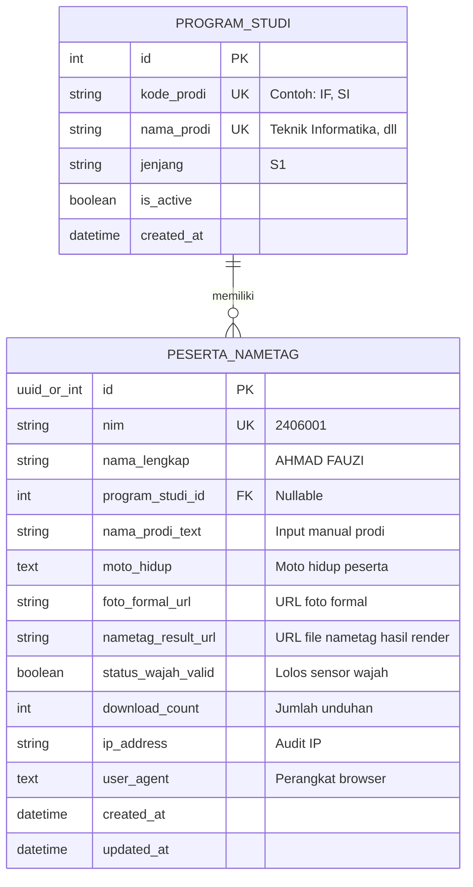

# 🗄️ Dokumentasi Desain Database MAFIKOM NAMETAG
**Fakultas Ilmu Komputer - Institut Teknologi Garut (ITG)**

Dokumentasi ini menjelaskan rancangan arsitektur database yang dirancang khusus untuk menampung data formulir pembuat nametag MAFIKOM (`index.html`).

---

## 📌 1. Analisis Kebutuhan Data

Berdasarkan formulir input dan proses generate nametag pada aplikasi, data yang wajib ditampung meliputi:

| Field Form | Tipe Data Rekomendasi | Keterangan & Karakteristik |
| :--- | :--- | :--- |
| **NIM** | `VARCHAR(20)` | **Unique Identifier**. Identitas unik setiap mahasiswa (contoh: `2406001`). |
| **Nama Lengkap** | `VARCHAR(150)` | Nama mahasiswa sesuai form (contoh: `AHMAD FAUZI`). |
| **Kelompok** | `VARCHAR(100)` | Kelompok peserta MAFIKOM (contoh: `KELOMPOK 01`). |
| **Moto Hidup** | `TEXT` | Moto hidup mahasiswa (biasanya diapit tanda kutip). |
| **Foto Formal** | `VARCHAR(500)` / `TEXT` | **URL / Path File Foto** (disimpan di file storage, BUKAN binary di DB). |
| **File Hasil Nametag** | `VARCHAR(500)` / `TEXT` | *(Opsional)* URL hasil render gambar nametag PNG. |
| **Status Wajah** | `BOOLEAN` / `TINYINT` | Status apakah foto lolos verifikasi sensor AI wajah (`BlazeFace`). |
| **Download Count** | `INT` | Menghitung frekuensi cetak / unduh nametag oleh peserta. |
| **Audit Metadata** | `IP`, `User-Agent`, `Timestamps` | Waktu submit (`created_at`) dan waktu pembaharuan (`updated_at`). |

---

## ⚡ 2. Best Practice: Manajemen File Foto

> ⚠️ **PENTING: Jangan Simpan File Foto Sebagai String Base64 / BLOB di Database!**
> 
> Menyimpan gambar Base64 atau BLOB di dalam kolom database akan membuat ukuran database membengkak sangat cepat, query menjadi lambat, dan membebani memori server (RAM).
> 
> **Pendekatan Standar Industri:**
> 1. Foto formal disimpan di **Object Storage** (seperti Supabase Storage, AWS S3, Cloudinary) atau folder lokal server (misal `/public/uploads/`).
> 2. Database **hanya menyimpan URL atau path string** dari file foto tersebut (contoh: `https://storage.itg.ac.id/mafikom/uploads/2406001.png`).

---

## 🏗️ 3. Diagram Relasi Entitas (ERD)



---

## 📂 4. File Skema yang Disediakan

Di dalam folder `database/` telah disediakan 3 pilihan skema database sesuai dengan kebutuhan infrastruktur:

1. **[schema_postgresql.sql](file:///d:/MAFIKOM/MAFIKOM-NAMETAG/database/schema_postgresql.sql)**  
   * **Target:** PostgreSQL atau **Supabase**.
   * **Kelebihan:** Mendukung tipe data UUID v4, trigger otomatis `updated_at`, dan dapat langsung dihubungkan ke frontend via Supabase JS SDK tanpa membuat server backend sendiri.

2. **[schema_mysql.sql](file:///d:/MAFIKOM/MAFIKOM-NAMETAG/database/schema_mysql.sql)**  
   * **Target:** MySQL / MariaDB (XAMPP, cPanel, phpMyAdmin).
   * **Kelebihan:** Sangat umum digunakan di server kampus atau hosting PHP tradisional.

3. **[schema_sqlite.sql](file:///d:/MAFIKOM/MAFIKOM-NAMETAG/database/schema_sqlite.sql)**  
   * **Target:** SQLite.
   * **Kelebihan:** Ringan, format single-file tanpa perlu install server database (cocok untuk backend lokal Node.js / Python / Go).

4. **[seed_data.sql](file:///d:/MAFIKOM/MAFIKOM-NAMETAG/database/seed_data.sql)**  
   * Data awal program studi dan contoh data peserta untuk keperluan testing.

---

## 🔌 5. Contoh Cara Menghubungkan Frontend `index.html`

### Opsi A: Menggunakan Supabase (Tanpa Backend Server / Serverless)

Karena proyek ini adalah file statis `index.html`, opsi paling praktis adalah menggunakan **Supabase**:
1. Tambahkan Supabase JS di `<head>`:
   ```html
   <script src="https://cdn.jsdelivr.net/npm/@supabase/supabase-js@2"></script>
   ```
2. Upload foto ke Supabase Storage, lalu simpan datanya ke tabel `peserta_nametag`:
   ```javascript
   const supabase = window.supabase.createClient('SUPABASE_URL', 'SUPABASE_ANON_KEY');

   async function simpanDataPeserta(nim, nama, prodi, moto, fotoBlob) {
       // 1. Upload Foto Formal ke Storage Bucket
       const fileName = `foto_${nim}_${Date.now()}.png`;
       const { data: uploadData, error: uploadErr } = await supabase.storage
           .from('foto-peserta')
           .upload(fileName, fotoBlob);

       if (uploadErr) throw uploadErr;

       const { data: { publicUrl } } = supabase.storage
           .from('foto-peserta')
           .getPublicUrl(fileName);

       // 2. Simpan Data ke Tabel peserta_nametag (Upsert berdasarkan NIM)
       const { data, error } = await supabase
           .from('peserta_nametag')
           .upsert({
               nim: nim,
               nama_lengkap: nama,
               nama_prodi_text: prodi,
               moto_hidup: moto,
               foto_formal_url: publicUrl,
               download_count: 1
           }, { onConflict: 'nim' });

       if (error) throw error;
       return data;
   }
   ```

---

### Opsi B: Menggunakan REST API Backend (Node.js / Express atau PHP)

Jika Anda memiliki server backend sendiri:
```javascript
// Di fungsi downloadImage() pada index.html sebelum atau sesudah unduh:
const formData = new FormData();
formData.append('nim', document.getElementById('inputNIM').value.trim());
formData.append('nama', document.getElementById('inputNama').value.trim().toUpperCase());
formData.append('prodi', document.getElementById('inputKelompok').value.trim().toUpperCase());
formData.append('moto', document.getElementById('inputMoto').value.trim());
formData.append('foto', currentBlob, 'formal.png');

fetch('/api/peserta', {
    method: 'POST',
    body: formData
}).then(res => res.json()).then(data => {
    console.log("Data nametag berhasil tersimpan di database:", data);
});
```

---

## 📊 6. Query Berguna Untuk Panitia MAFIKOM

### A. Melihat Rekap Seluruh Peserta
```sql
SELECT * FROM view_rekap_peserta_nametag;
```

### B. Menghitung Jumlah Peserta per Program Studi
```sql
SELECT * FROM view_statistik_prodi;
```

### C. Mencari Data Mahasiswa Berdasarkan NIM
```sql
SELECT * FROM peserta_nametag WHERE nim = '2406001';
```
